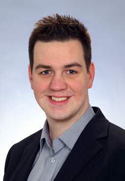

{:#portrait}

René Schönfelder
{:#name}

Software&nbsp;Engineer&nbsp;and Research&nbsp;Assistant
{:#profession}

You can contact me in german, english or simple norwegian via

| Email  | [schoenfelder2211@gmail.com](mailto:schoenfelder2211@gmail.com) |
| Skype  | reneschoenfelder |
| Github | [schoenfr](http://github.com/schoenfr){:target="_blank"} |
| XING | [René Schönfelder](http://www.xing.com/profile/Rene_Schoenfelder3){:target="_blank"} |
{:.vitatable}

# <iron-icon icon="social:school" /> Education

| Since 2012 | __University of Lübeck, [Institute for Software Engineering and Programming Languages](https://www.isp.uni-luebeck.de/){:target="_blank"}__   Graduation  to Dr. rer. nat. (aspired), supervised by Prof. Dr. Martin Leucker   Title: Algebraic Routing for Green Navigation |
| 2014 | __University of Lübeck, Dozierenden-Service-Center__   Certificate for University Didactics   Professional training in didactics, methods, exams, media, leading, and diversity amounting 19 weekend courses |
| 2012 | __University of Lübeck__   Computer Science, M.Sc.   Thesis: [Stochastic Models and Acceleration Techniques for Green Routing in Car Navigation Systems](http://rene.odyne.net/resources/ma_schoenfelder.pdf){:target="_blank"} |
| 2011 | __University of Oslo__   Exchange semester |
| 2009 | __University of Lübeck__   Computer Science, B.Sc.   Thesis: Structural Properties of m-Step Graphs |
| 2005 | __Otto-Hahn-Schule, Hamburg__   Abitur |
{:.vitatable}

# <iron-icon icon="favorite" /> Interests

- Mathematics, especially Algebra and Graph Theory
- Software Engineering and Verification
- Project Management, Agile Development
- Teaching and Mentoring
- ... and my friends and family

# <iron-icon icon="places:business-center" /> Job Experience

| Since 07/2015 | __[WMD Vertrieb GmbH](http://www.wmd.de/){:target="_blank"}, Ahrensburg__   Student assistant   Front- and backend development for the [WMD xSuite 365](http://www.wmd.de/dyn/epctrl/mod/wmd000224/cat/wmd000439/pri/wmd){:target="_blank"} |
| Since 03/2012 | __University of Lübeck, Institute for Software Engineering and Programming Languages__   Scientific staff and doctoral student   Project management, software development, and scientific research on [Green Navigation](http://www.isp.uni-luebeck.de/research/projects/green-navigation){:target="_blank"}   Teaching assistant for software engineering |
{:.vitatable}

# <iron-icon icon="communication:forum" /> Teaching

<table class="responsive" style="width: 100%">
<thead>
  <tr>
    <th>Term</th>
    <th>Role</th>
    <th>Title</th>
    <th>Type</th>
    <th>Lecturer</th>
  </tr> 
</thead>
<tbody>

<tr>
  <td label="Term" style="white-space: nowrap;">{{x.term}}</td>
  <td label="Role">{{x.role}}</td>
  
  <td label="Title"><a href="{{x.link}}" target="_blank">{{x.name}}</a></td>
  
  <td label="Title">{{x.name}}</td>
  
  <td label="Type">{{x.type}}</td>
  
  <td label="Lecturer">{{x.lecturer}}</td>
  
</tr>

</tbody>
</table>

Furthermore, I have assisted in a series of student theses and managed various practical courses, primarily around Green Navigation.

# <iron-icon icon="maps:local-library" /> Publications


- {{x.author}} ({{x.year}}):   <a href="{{x.link}}" target="_blank">{{x.title}}</a>.   {{x.published}}, pp {{x.pages}}.


# <iron-icon icon="grade" /> Grants/Awards

- Doctoral scholarship by the [EKSH Gesellschaft für Energie und Klimaschutz Schleswig-Holstein GmbH](http://eksh.org){:target="_blank"} (2013-2016).
- Capgemini award for the best master degree in computer science at the University of Lübeck (2012).
- Erasmus scholarship for an exchange semester at the University of Oslo (2011).

# <iron-icon icon="more-horiz" /> Activities

- Senate Panel MINT at the University of Lübeck, student representative (2014/2015).
- Mentoring *first generation students* at [Arbeiterkind.de](http://arbeiterkind.de){:target="_blank"} Lübeck (2011-2015).
