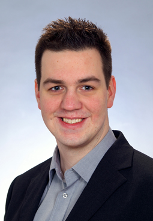

{:#portrait}

René Schönfelder
{:#name}

Software&nbsp;Engineer&nbsp;and Research&nbsp;Assistant
{:#profession}

You can contact me in german or english via

| Email  | [schoenfelder2211@gmail.com](mailto:schoenfelder2211@gmail.com) |
| Skype  | reneschoenfelder |
| Github | [schoenfr](http://github.com/schoenfr){:target="_blank"} |
| XING | [René Schönfelder](http://www.xing.com/profile/Rene_Schoenfelder3){:target="_blank"} |

# <iron-icon icon="social:school" /> Education

| Currently | University of Lübeck   Working on a PhD about Algebraic Routing for Green Navigation |
| 2014 | Certificate for University Didactics - University of Lübeck |
| 2012 | M.Sc. Computer Science - University of Lübeck   Thesis: [Stochastic Models and Acceleration Techniques for Green Routing in Car Navigation Systems](http://rene.odyne.net/resources/ma_schoenfelder.pdf){:target="_blank"} |
| 2009 | B.Sc. Computer Science - University of Lübeck   Thesis: Structural Properties of m-Step Graphs |
{:class="vitatable"}

# <iron-icon icon="favorite" /> Interests

- Mathematics, especially Algebra and Graph Theory
- Software Engineering and Verification
- Project Management, Agile Development
- Teaching and Mentoring
- ... and my friends and family

# <iron-icon icon="places:business-center" /> Experience

| Since 2015 | [WMD Vertrieb GmbH](http://www.wmd.de/){:target="_blank"} |
| 2011 - 2016 | [Green Navigation](http://www.isp.uni-luebeck.de/research/projects/green-navigation){:target="_blank"} |

# <iron-icon icon="communication:forum" /> Teaching

<table class="responsive" style="width: 100%">
<thead>
  <tr>
  	<th>Term</th>
  	<th>Role</th>
  	<th>Title</th>
  	<th>Type</th>
  	<th>Lecturer</th>
  </tr>	
</thead>
<tbody>

<tr>
  <td label="Term" style="white-space: nowrap;">{{x.term}}</td>
  <td label="Role">{{x.role}}</td>
  
  <td label="Title"><a href="{{x.link}}" target="_blank">{{x.name}}</a></td>
  
  <td label="Title">{{x.name}}</td>
  
  <td label="Type">{{x.type}}</td>
  
  <td label="Lecturer">{{x.lecturer}}</td>
  
</tr>

</tbody>
</table>

Furthermore, I have assisted in a series of student theses and managed various practical courses, primarily around Green Navigation.

# <iron-icon icon="maps:local-library" /> Publications


- {{x.author}} ({{x.year}}):   <a href="{{x.link}}" target="_blank">{{x.title}}</a>.   {{x.published}}, pp {{x.pages}}.


# <iron-icon icon="grade" /> Grants/Awards

- Doctoral scholarship by the [EKSH Gesellschaft für Energie und Klimaschutz Schleswig-Holstein GmbH](http://eksh.org){:target="_blank"} (2013-2016).
- Capgemini award for the best master degree in computer science at the University of Lübeck (2012).
- Erasmus scholarship for an exchange semester at the University of Oslo (2011).

# <iron-icon icon="more-horiz" /> Other Activities

- [Arbeiterkind.de](http://arbeiterkind.de){:target="_blank"}, mentoring *first-generation students* (2011-2015).
